# Office Sync


> A GPS-based attendance tracking application that validates user location within a 50-meter radius of a predefined office location, enabling automatic attendance marking with real-time distance tracking and offline-first architecture.

---

## Table of Contents

- [Technical Stack](#technical-stack)
- [Architecture & Project Structure](#architecture--project-structure)
- [Generative AI Usage](#generative-ai-usage)
- [How to Run](#how-to-run)
- [Screenshots](#screenshots)
- [License](#license)

---

## Technical Stack

| Layer | Technology | Purpose |
|---|---|---|
| UI Framework | [Flutter](https://flutter.dev) 3.8.1 | Cross-platform UI rendering |
| Language | Dart 3.8.1 | Primary programming language |
| State Management | [flutter_bloc](https://pub.dev/packages/flutter_bloc) 8.1.6 | BLoC pattern implementation |
| Dependency Injection | [get_it](https://pub.dev/packages/get_it) 7.7.0 | Service locator pattern |
| Local Storage | [hive](https://pub.dev/packages/hive) 2.2.3 & [hive_flutter](https://pub.dev/packages/hive_flutter) 1.1.0 | Offline-first NoSQL database |
| Location Services | [geolocator](https://pub.dev/packages/geolocator) 13.0.2 | GPS positioning and distance calculation |
| Permissions | [permission_handler](https://pub.dev/packages/permission_handler) 11.3.1 | Runtime permission management |
| Functional Programming | [dartz](https://pub.dev/packages/dartz) 0.10.1 | Either type for error handling |
| Utilities | [equatable](https://pub.dev/packages/equatable) 2.0.8 | Value equality for entities and models |
| UUID | [uuid](https://pub.dev/packages/uuid) 4.5.1 | Unique identifier generation |
| Internationalization | [intl](https://pub.dev/packages/intl) 0.19.0 | Date/time formatting |

> For the full dependency list refer to [`pubspec.yaml`](./pubspec.yaml).

---

## Architecture & Project Structure

### Architectural Approach

This project follows **Clean Architecture** principles with strict layer separation across **Presentation**, **Domain**, and **Data** layers. Each layer maintains clear boundaries and dependencies flow inward, ensuring the core business logic (Domain layer) remains framework-agnostic and fully testable.

**State management** is handled exclusively through the **BLoC (Business Logic Component) pattern**. UI components are stateless and reactive—they dispatch `Events` to BLoCs and rebuild in response to emitted `States`. This unidirectional data flow eliminates imperative state mutations and keeps the UI declarative.

**Offline-first design** is achieved through Hive local storage with TypeAdapters for persistence. All critical data (office location, attendance records) is stored locally, ensuring full functionality without network connectivity.

**Geofencing validation** uses the Haversine formula to calculate precise distances between GPS coordinates, validating the user is within a 50-meter radius of the office location before enabling attendance marking.

### Project Structure

```
lib/
├── core/                        # App-wide utilities, constants, theme, routing
│   ├── constants/
│   │   ├── app_constants.dart          # App name, version constants
│   │   ├── storage_keys.dart           # Hive box names and type IDs
│   │   └── geo_constants.dart          # Geofencing constants (50m radius)
│   ├── error/
│   │   ├── failures.dart               # Abstract failure types
│   │   └── exceptions.dart             # Custom exception classes
│   ├── usecases/
│   │   └── usecase.dart                # Base UseCase abstract class
│   ├── utils/
│   │   └── distance_calculator.dart    # Haversine formula for GPS distance
│   ├── di/
│   │   └── injection_container.dart    # GetIt DI setup
│   ├── routes/
│   │   └── app_routes.dart             # Route definitions
│   └── theme/
│       ├── app_theme.dart              # Material theme configuration
│       └── app_colors.dart             # Color palette
├── features/                    # Feature modules (Clean Architecture)
│   ├── location/                # Location feature module
│   │   ├── data/
│   │   │   ├── models/
│   │   │   │   ├── office_location_model.dart
│   │   │   │   └── office_location_model.g.dart    # Hive generated
│   │   │   ├── datasources/
│   │   │   │   └── location_local_data_source.dart # Hive operations
│   │   │   └── repositories/
│   │   │       └── location_repository_impl.dart   # Uses Geolocator
│   │   ├── domain/
│   │   │   ├── entities/
│   │   │   │   └── office_location.dart            # Pure Dart entity
│   │   │   ├── repositories/
│   │   │   │   └── location_repository.dart        # Abstract interface
│   │   │   └── usecases/
│   │   │       ├── calculate_distance.dart
│   │   │       ├── check_location_permission.dart
│   │   │       ├── check_location_service.dart
│   │   │       ├── get_current_location.dart
│   │   │       ├── get_office_location.dart
│   │   │       ├── request_location_permission.dart
│   │   │       ├── reset_office_location.dart
│   │   │       ├── save_office_location.dart
│   │   │       └── validate_geo_fence.dart
│   │   └── presentation/
│   │       ├── bloc/
│   │       │   ├── location_bloc.dart
│   │       │   ├── location_event.dart
│   │       │   └── location_state.dart
│   │       └── widgets/
│   │           ├── distance_indicator.dart
│   │           ├── permission_request_widget.dart
│   │           └── setup_location_widget.dart
│   └── attendance/              # Attendance feature module
│       ├── data/
│       │   ├── models/
│       │   │   ├── attendance_record_model.dart
│       │   │   └── attendance_record_model.g.dart  # Hive generated
│       │   ├── datasources/
│       │   │   └── attendance_local_data_source.dart
│       │   └── repositories/
│       │       └── attendance_repository_impl.dart
│       ├── domain/
│       │   ├── entities/
│       │   │   └── attendance_record.dart          # Pure Dart entity
│       │   ├── repositories/
│       │   │   └── attendance_repository.dart      # Abstract interface
│       │   └── usecases/
│       │       ├── clear_all_attendance.dart
│       │       ├── delete_attendance.dart
│       │       ├── get_attendance_history.dart
│       │       └── mark_attendance.dart
│       └── presentation/
│           ├── bloc/
│           │   └── attendance/
│           │       ├── attendance_bloc.dart
│           │       ├── attendance_event.dart
│           │       └── attendance_state.dart
│           ├── pages/
│           │   ├── attendance_screen.dart          # Main screen
│           │   └── attendance_history_screen.dart
│           └── widgets/
│               ├── attendance_button.dart
│               └── loading_indicator.dart
├── main.dart                    # App entry point with Hive initialization
└── app.dart                     # Root app widget with BlocProviders
```

### BLoC Classes

| BLoC | Responsibility |
|---|---|
| `LocationBloc` | Manages location permissions, GPS service status, office location setup, real-time distance tracking, and geofence validation |
| `AttendanceBloc` | Handles attendance marking (check-in/check-out), fetching attendance history, and managing attendance records |

### Key Use Cases

**Location Feature:**
- `CheckLocationPermission` - Verifies if location permission is granted
- `RequestLocationPermission` - Requests location permission from user
- `CheckLocationService` - Validates if GPS is enabled
- `GetCurrentLocation` - Fetches current GPS coordinates
- `SaveOfficeLocation` - Persists office coordinates to Hive
- `GetOfficeLocation` - Retrieves saved office location
- `ResetOfficeLocation` - Clears saved office location
- `CalculateDistance` - Computes distance between two GPS points using Haversine formula
- `ValidateGeoFence` - Checks if user is within 50-meter radius

**Attendance Feature:**
- `MarkAttendance` - Records attendance with timestamp, coordinates, and distance
- `GetAttendanceHistory` - Retrieves all attendance records from Hive
- `DeleteAttendance` - Removes a specific attendance record
- `ClearAllAttendance` - Deletes all attendance records

---

## Generative AI Usage

AI-assisted development (GitHub Copilot with Claude Sonnet 4.5) was used extensively throughout this project to accelerate implementation while maintaining architectural integrity. Every AI-generated output was reviewed, refactored to match Clean Architecture principles, and tested before integration.

### How It Was Used

| Area | Prompt Used | How Output Was Adapted |
|---|---|---|
| **BLoC Boilerplate** | "Generate a Flutter BLoC class for location management that handles permission requests, GPS service checks, office location saving/loading from Hive, real-time location tracking with StreamSubscription, and geofence validation using Geolocator. Include events for initialization, permission handling, location tracking start/stop, and location updates. States should cover loading, permission denied, service disabled, location loaded, office saved, and validation results." | Refactored state classes to use Equatable for value comparison. Split complex initialization logic into separate event handlers. Added lifecycle management with StreamSubscription cancellation in bloc's close() method. Integrated domain layer use cases instead of direct repository calls. |
| **Clean Architecture Layers** | "Create a complete Clean Architecture implementation for a location feature in Flutter with domain entities (OfficeLocation), repository interfaces, use cases (SaveOfficeLocation, GetCurrentLocation, ValidateGeoFence), data models with Hive TypeAdapters, local data sources using Hive boxes, and repository implementations using Geolocator. Use Dartz Either for error handling and create custom Failure types." | Reorganized folder structure to match feature-based separation. Renamed files to follow snake_case convention consistently. Added injectable annotations for GetIt dependency injection. Created separate exceptions and failures for better error granularity. Implemented proper entity-to-model mapping in repositories. |
| **Haversine Distance Calculation** | "Implement the Haversine formula in Dart to calculate the great-circle distance between two GPS coordinates (latitude/longitude pairs). Return distance in meters. Include Earth radius constant and proper radian conversions." | Moved implementation to a dedicated utility class (`DistanceCalculator`) in core/utils. Added comprehensive documentation explaining the formula. Created a corresponding use case (`CalculateDistance`) that wraps the utility for domain layer access. |
| **Hive TypeAdapters** | "Generate Hive TypeAdapter classes for OfficeLocation and AttendanceRecord models. OfficeLocation has id (String), latitude (double), longitude (double), radius (double), savedAt (DateTime). AttendanceRecord has id (String), timestamp (DateTime), latitude (double), longitude (double), distanceFromOffice (double), type (String). Use proper field indexing and include toEntity/fromEntity methods." | Separated concerns by creating pure domain entities alongside Hive models. Added @HiveType and @HiveField annotations correctly. Implemented bidirectional mapping methods (toEntity/fromEntity) for Clean Architecture compliance. Registered TypeAdapters in injection container with proper type IDs. |
| **UI State Handling** | "Create an AttendanceScreen in Flutter that uses BlocBuilder and BlocListener to handle location states (permission denied, GPS disabled, location loading, office location loaded, distance tracking) and attendance states. Show permission request widget when denied, GPS enable prompt when disabled, setup location button when no office saved, real-time distance indicator when tracking, and attendance button enabled only within 50m geofence. Use Material 3 design with proper error handling and loading states." | Restructured to use separate BlocBuilders for location and attendance states instead of single nested builder. Extracted complex widgets (PermissionRequestWidget, SetupLocationWidget, DistanceIndicator, AttendanceButton) into dedicated files for reusability. Added WidgetsBindingObserver to detect app lifecycle changes and re-check permissions when returning from settings. Implemented proper dispose() to cancel location tracking subscriptions. |
| **Dependency Injection Setup** | "Create a GetIt service locator configuration for Flutter app with Clean Architecture. Register LocationBloc, AttendanceBloc, all use cases (GetCurrentLocation, SaveOfficeLocation, etc.), repositories (LocationRepository, AttendanceRepository), data sources (LocationLocalDataSource, AttendanceLocalDataSource), and external dependencies (Geolocator, Hive). Include Hive initialization and TypeAdapter registration." | Switched from injectable code generation to manual GetIt registration for better control. Added async initialization function that ensures Hive is initialized before registering services. Created factory registrations for BLoCs and singleton registrations for repositories and data sources. Properly initialized Hive boxes and registered TypeAdapters before any repository access. |

> **Note:** All AI-generated code underwent rigorous code review to ensure type safety, null safety compliance, architectural consistency, proper error propagation through Either types, and adherence to Flutter/Dart best practices. Complex business logic (geofence validation, real-time tracking) was manually implemented and tested beyond AI suggestions.

---

## How to Run

### Prerequisites

Ensure the following are installed and configured on your machine before proceeding.

- [Flutter SDK](https://docs.flutter.dev/get-started/install) (version 3.8.1 or above)
- Dart SDK (bundled with Flutter)
- Android Studio or Xcode (for running on a simulator or physical device)
- A connected device or running emulator

Verify your Flutter environment is ready by running:

```bash
flutter doctor
```

All checkmarks should be green before continuing.

### Setup & Run

**1. Clone the repository**

```bash
git clone https://github.com/yourusername/office_sync.git
cd office_sync
```

**2. Install dependencies**

```bash
flutter pub get
```

**3. Generate Hive TypeAdapters** (if not already generated)

```bash
flutter pub run build_runner build --delete-conflicting-outputs
```

**4. Run the app**

```bash
# Run on a connected device or emulator
flutter run

# Run on a specific device
flutter run -d <device-id>

# Run in release mode
flutter run --release
```

**5. Run tests** (optional but recommended)

```bash
flutter test
```

### Platform-Specific Configuration

**Android:**
- Minimum SDK: 21 (Android 5.0 Lollipop)
- Location permissions are automatically requested at runtime

**iOS:**
- Minimum iOS version: 12.0
- Requires location permission descriptions in `Info.plist` (already configured)

---

## Screenshots

<div align="center">
  
</div>

<div align="center">
  
  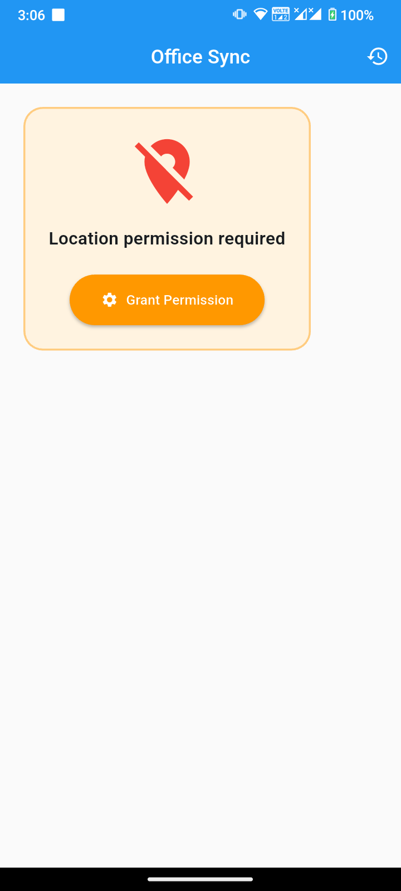
  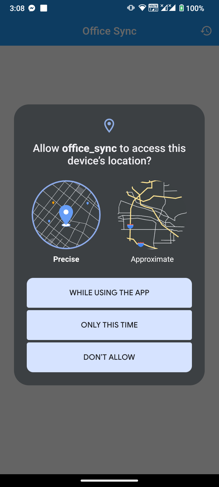
</div>

<div align="center">
  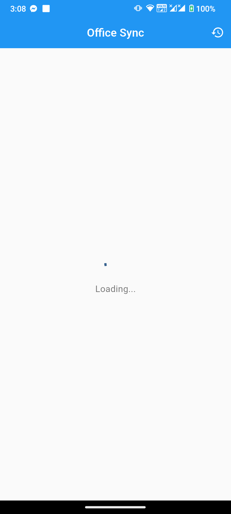
  
  
</div>

<div align="center">
  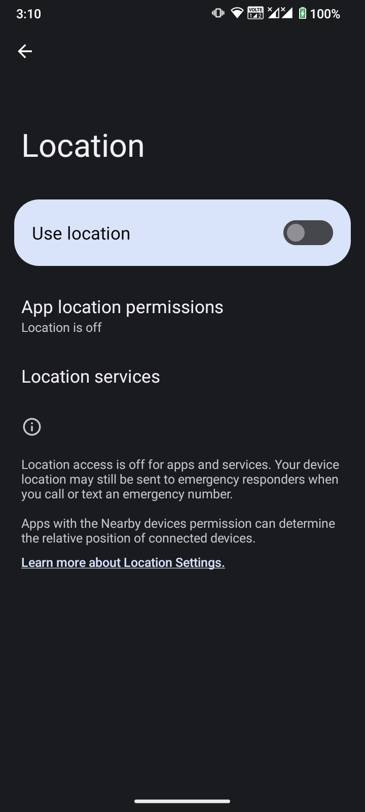
  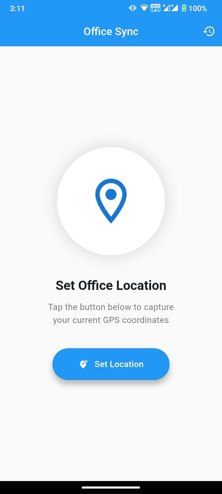
  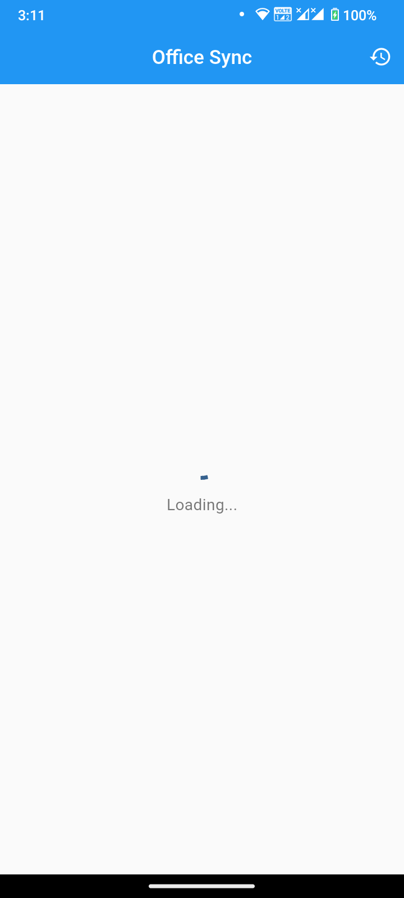
</div>

<div align="center">
  
  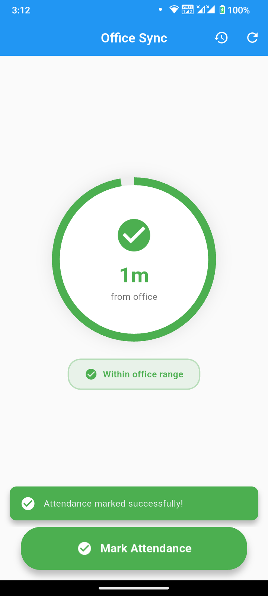
  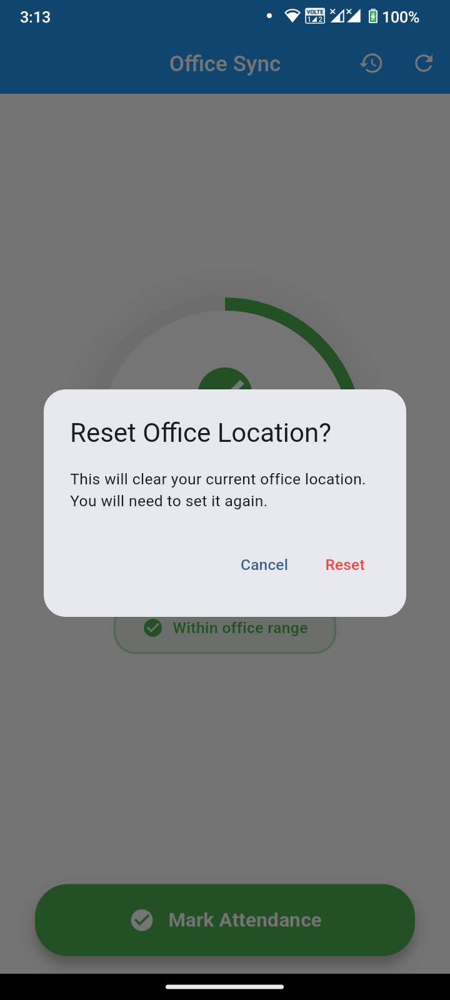
</div>

<div align="center">
  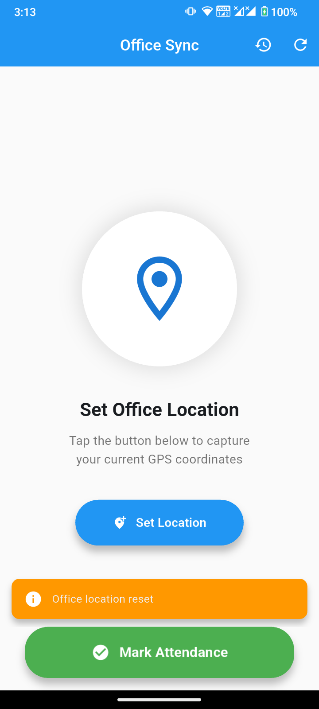
  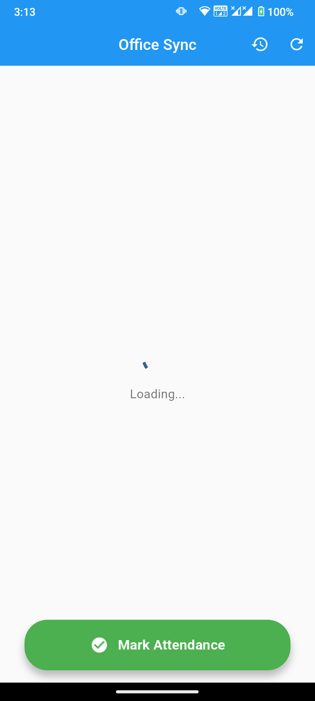
  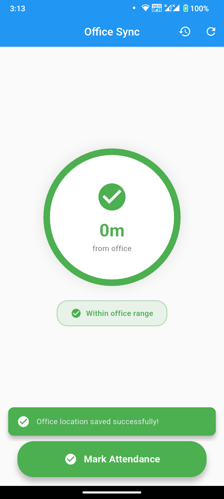
</div>

---

## License

This project is licensed under the [MIT License](./LICENSE).